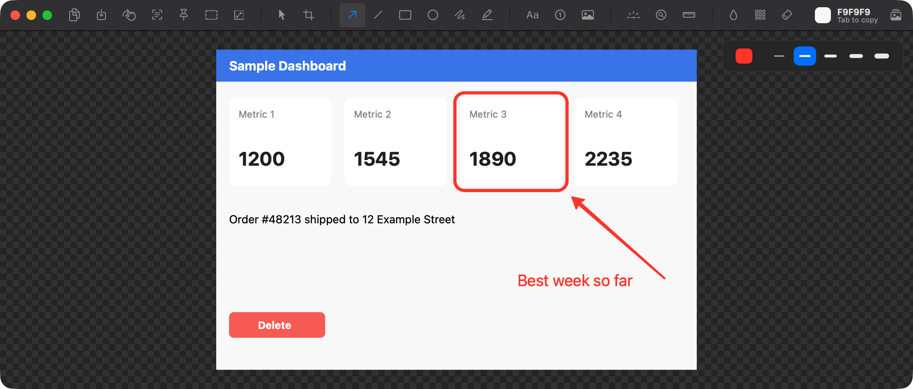

# Tinysnap

A menu bar screenshot app for macOS. Press Command+Shift+2, drag, and the capture opens
in an editor where you can annotate it, redact it, frame it and copy it, all without an
account, a server or a subscription.



## Install

```bash
brew install faizanashiq/tap/tinysnap
```

Or clone and build:

```bash
git clone https://github.com/FaizanAshiq/tinysnap.git
cd tinysnap
./build.sh release --install
```

Both compile on your machine, which is what keeps first launch clean. See below for
why that matters. Tinysnap needs macOS 14 Sonoma or later.

On Windows 10 or 11, run `Tinysnap-win-x64-Setup.exe` (or `-arm64`) from the
[latest release](https://github.com/FaizanAshiq/tinysnap/releases/latest); it installs for you
alone, with no admin prompt. On Linux with GNOME, download `Tinysnap-linux-x64.AppImage` (or
`-arm64`) from the same release, make it executable and run it. More in
[dotnet/README.md](dotnet/README.md).

## Capturing

| Hotkey | What it does |
| --- | --- |
| `Command+Shift+2` | Capture an area, or press `Space` first and click a window |
| `Command+Shift+1` | Capture the whole screen under the pointer |
| `Command+Shift+O` | Capture an area and copy the text in it |
| Unset | Capture a window by clicking it, scan a QR code in an area and copy what it holds, repeat the last area, capture after a delay (3 seconds unless you change it), open the library |

Every hotkey can be changed or cleared in Settings, and every capture is also on the menu
bar icon.

| While selecting | Effect |
| --- | --- |
| `Shift` | Square the box |
| `Option` | Draw the box out from its centre |
| `Space` while dragging | Move the whole box |
| Arrow keys | Nudge the corner being dragged by 1 pt |
| `Esc` | Cancel |

A window capture keeps the window's rounded corners transparent and leaves its shadow out.

## Editing

| Tool | Key | | Tool | Key |
| --- | --- | --- | --- | --- |
| Select | `V` | | Text | `T` |
| Crop | `C` | | Step number | `N` |
| Arrow | `A` | | Pasted image | `I` |
| Line | `L` | | Spotlight | `S` |
| Rectangle | `R` | | Magnifier | `M` |
| Oval | `O` | | Blur | `B` |
| Freehand | `F` | | Pixelate | `P` |
| Highlighter | `H` | | Erase | `E` |
| Measure | `D` | | | |

Blur and pixelate can be partly reversed by a determined reader. Erase paints over the
pixels and is the only redaction to trust with a password or a card number.

| Input | Effect |
| --- | --- |
| `Command+C` | Copy the image and close the editor |
| `Command+S` | Save to the save folder and close the editor. `Command+Shift+S` asks where, then closes |
| `Command+P` | Pin the image on top of every app and close the editor |
| `Command+Shift+C` | Copy Text: each drag copies the text under it and a click copies all of it. It stays on until `Esc`, another tool or a second press |
| `Command+Shift+R` | Copy what a QR code in the image holds, one per line when there are several |
| `Tab` | Copy the hex colour under the pointer |
| `Shift` while drawing | Straighten a line to 45 degrees, or square a box |
| `Option` while drawing | Draw out from the centre |
| `Space` while drawing | Move the shape being drawn |
| `[` and `]` | Thinner and thicker |
| Arrow keys | Nudge the selection by 1 pixel, or 10 with `Shift` |
| `Command` held | Show the border of everything drawn, and pick up anything under the pointer |
| Dragging a shape | Line its edges and middle up on other shapes and the capture, with a guide; hold `Command` to place it freely |
| `Delete` | Remove the selection, as the trash button in the panel does |
| `Command+=`, `Command+-`, `Command+0`, `Command+1` | Zoom in, out, to fit, to actual size |
| `Esc` | Deselect, then close |

The tool you pick stays out until you pick another: pasting, Copy Text and the panels
never switch it. Click a shape's outline, or anywhere on a blur, an erase or a piece of text, to select it and drag it, whatever tool is out. Drawing past the edge of
the capture grows the canvas, filled with the capture's own edge colour. The drag handle
in the toolbar drops the image straight into another app.

### Backdrop

The Backdrop button frames the capture for sharing: a gradient picked from the capture's
own colours, a solid colour, your desktop wallpaper, or a see-through PNG. Pick the
padding, how round the capture's corners are, and a soft or strong shadow. The editor
shows exactly what will be exported, and the crop tool shows the whole capture again
while you change the crop.

### Size

The Size button sets how big this capture exports: 25%, 50%, 100% or 200% of full
resolution, or an exact width or height in pixels with the shape kept. The capture keeps
it, so reopening it from the library shows the size it has, and 100% is one click away.
Copy, save, drag out, pins and the library all use it, while Copy Text and Scan QR Code
still read every pixel. A capture you have not sized starts at the Export setting.

### Measuring

The Measure tool reads the space under the pointer from the capture's own pixels and
shows its size in points, the unit your code is written in. `X` shows it across and `Y`
down, or both, and a click keeps the reading on the capture as a measurement you can move,
stretch or delete. When a card is only a shade off the page, `↓` finds fainter edges, and
`↑` fewer. The panel has a chip for each of these, and its question mark opens a short
guide.

### Comparing

Paste an image with `Command+V` to lay it over the capture. With it selected, the panel
sets its opacity, or keys `1` to `9` set 10% to 90% and `0` sets it solid. The Difference
chip turns everything that matches the capture black, so only what changed shows.

Boxes and ovals take the same opacity chips and keys, so a filled box can tint an area
instead of hiding it.

## After a capture

Settings chooses whether a capture opens the editor or waits as a thumbnail in the corner
of the screen. The thumbnail copies, saves or pins with one click, opens the editor when
clicked, and drags straight into another app. Swipe it away or leave it and it slides
off, kept in the library. With the library off it lands on the clipboard instead, so a
capture is never lost.

A pin floats above every app. Scroll over it to resize it, press
`1` to `9` or `0` for its opacity, and `Command+C`, `Command+S` or `Esc` to copy, save or
close it. Right-click it for the rest.

## The library

Every capture is kept for 30 days in
`~/Library/Application Support/Tinysnap/Library`, one folder each, annotations and all,
so reopening one lets you keep editing where you left off. Open it from the button at the
end of the capture window's toolbar, the Window menu, the menu bar icon, the Dock icon or
Settings. Its toolbar copies, saves, edits, pins or trashes the selected capture, and
Copy, Save and Edit also sit on any tile under the pointer. `Command+C` copies,
`Command+S` saves to the save folder, `Space` previews with Quick Look, `Return` edits,
and `Delete` moves a capture to the Trash.

The library keeps what is under blurs and erases too, since that is what makes them
editable later. Turn it off in Settings, or clear it from there, if that matters to you.

## Permissions

Screen Recording is the only permission Tinysnap asks for, the first time you capture.
It never asks for Accessibility, makes no network calls and has no accounts.

## Settings

Settings holds the hotkeys, which you set by clicking a field and pressing a
combination, the save folder (the Desktop at first), the size captures export at until
you give one its own, every pixel or one pixel per point, the capture delay, what happens after a capture, the library,
the menu bar and Dock icons, and opening at login. Everything is in
`~/Library/Application Support/Tinysnap/preferences.json`, and every key in that file is
optional, so you can delete down to the one line you care about and the rest falls back
to defaults.

## Building

Swift 6, Command Line Tools, no Xcode and no dependencies.

```bash
swift build          # compile
./test.sh            # run the tests
./build.sh           # produce dist/Tinysnap.app
```

`test.sh` exists because with Command Line Tools and no Xcode installed, Swift Package
Manager does not load the Swift Testing macro plugin, so plain `swift test` fails to
expand `@Test` at all. The script points the compiler at the plugin when it finds it and
falls straight through to `swift test` when it does not.

## Why it builds from source

The formula compiles Tinysnap on your Mac rather than fetching a prebuilt binary, so what
runs is built from the source in this repository.

It also opens on the first try. Quarantine is applied to downloaded files only, and since
macOS Sequoia there is no Control-click shortcut past it, so a downloaded build would send
you to System Settings, Privacy and Security to click Open Anyway before it would run. A
local build never picks the flag up.

One consequence is worth knowing about. An ad hoc signature is a hash of the binary, so
every upgrade looks like a new app to macOS and Screen Recording has to be granted all
over again. Run this once and that stops happening:

```bash
./scripts/signing-identity.sh
```

It makes a self signed certificate in your login keychain and `build.sh` signs with it
from then on, which keeps the identity fixed across builds. It is not a Developer ID and
changes nothing for anyone else.

## License

MIT
